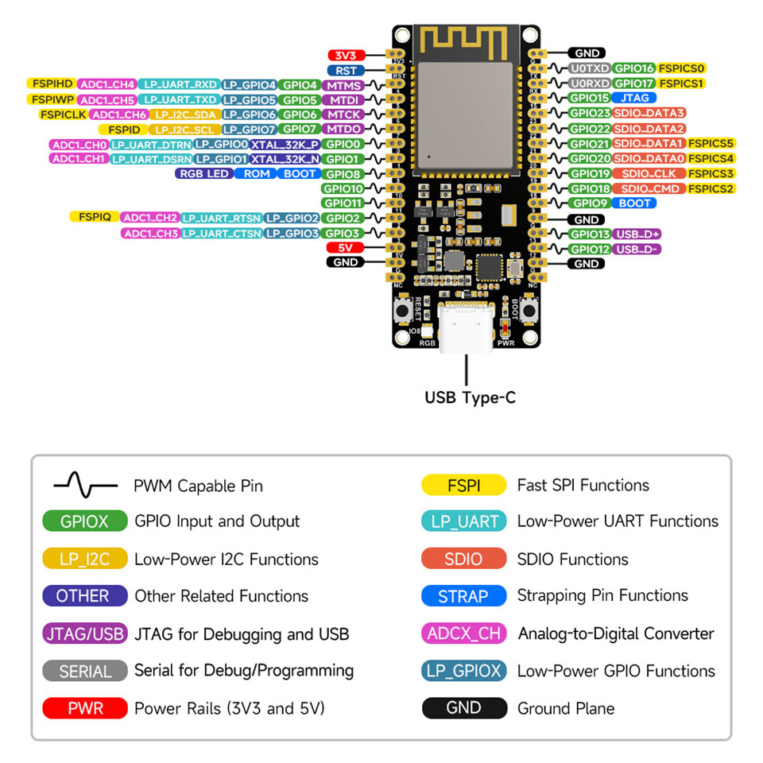

# DomoEsp1
Code pour un esp32 permettant d'envoyer sur un broket mqtt le status de 8 pin et une temperature.
Le statut des pin et de la temperature est visible sur une page web hébergée sur l'ESP32 via websocket.
La valeur d'une pin est envoyée sur le broker mqtt (et via websocket) lors du changement d'état de cette pin.
La valeur de la température est envoyée sur le borker mqtt (et via websocket) toutes les 60sec

## Setup du programme
- Initialisation de la led et l'éteindre
- Initialisation du port Serial et attendre 3sec
- Initialisation des pin en mode "entrée" et lire leur statut
- Initialisation du capteur de temperature DS18B20
- Initialisation de gestionnaire de fichier LittleFs
- Lire les fichier contenant les données de connection (wifi, mqtt)
- Si un ssid est défini
  - se connecter au routeur wifi
  - demarrer un serveur local avec les fichiers html pour lire les valeur des pin et de la temperature
  - configurer le websocket
  - changer la couleur de la led en vert
- Si le ssid est vide
  -  Initialisation du wifi en mode access point (ip= 192.168.4.1)
  -  demarrer un serveur local avec les fichiers html pour entrer les parametres de connections wifi et mqtt
  -  changer la couleur de la led en bleu
- Si le wifi est connecté au routeur
  - Connection au serveur MQTT
  - Si on est connecté au serveur mqtt alors envoyer les statut des pin
- Configuter l'adresse mDNS (domo1.local)

## Loop du programme
- analyse de la température toutes les 60sec et l'envoyer au broker mqtt (et websocket)
- analyse du changement de statu de toutes les pin et envoie du nouveau statu si il a changé au broket mqtt (et websocket)

## Couleur de la led
- vert: wifi connecté au routeur
- bleu: wifi en mode access point

## Message MQTT
- L'ESP32 fait un subscribe sur le topic "Domo1/Get". Si le payload = "All" alors il envoit le status de toutes les pin sur leur topic.
- L'ESP32 publie le statu d'une pin sur le topic "Domo1/PinX" (ou x est le numéro de la pin allant de 1 à 8). Le payload contient la statu de la pin

## Pinout ESP32

| GPIO   | MQTT   | source   | status   |
|:------ |:------ |:-------- |:-------- |
| GPIO03 | Temp1  | sonde DS18B20 | température deg |
| GPIO02 | Pin1   | Porte garage (aimant) | 0 = porte fermée |
| GPIO11 | Pin2   | Porte Atelier | 1 = porte fermée |
| GPIO10 | Pin3   | Porte Fen SAM | 1 = porte fermée |
| GPIO01 | Pin4   | Porte Fen Cuisine | 1 = porte fermée |
| GPIO00 | Pin5   | Porte garage (alarme) | 1 = porte fermée |
| GPIO07 | Pin6   | Armé Absent | 1 = non armé |
| GPIO06 | Pin7   | Armé Nuit | 1 = non armé |
| GPIO05 | Pin8   | Porte Entree | 1 = porte fermée |
