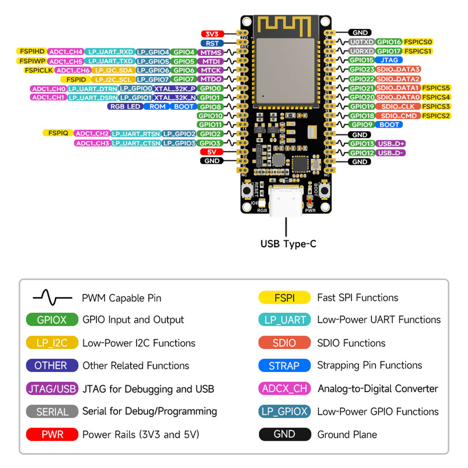

# DomoEsp1
Firmware ESP32 (PlatformIO / Arduino) qui lit 8 boutons + une temperature et publie leur état sur un broker MQTT, via la connexion WiFi gérée par la librairie `WifiAuto`.
La valeur d'une pin est envoyée sur le broker mqtt lors du changement d'état de cette pin.
La valeur de la température est envoyée sur le borker mqtt toutes les 60sec

## Fonctionnement général

1. Au démarrage, `WifiAuto` connecte l'ESP32 au WiFi puis au broker MQTT (portail de configuration si aucun identifiant n'est enregistré).
2. Une fois connecté au broker, l'ESP32 s'abonne au topic `CONFIG_MQTT_TOPIC_GET`.
3. Chaque changement d'état d'un bouton (après anti-rebond) est publié sur `CONFIG_MQTT_TOPIC_PIN` + numéro du bouton, avec la valeur `0` ou `1`.
4. Toutes les 60 secondes la valeur de la sonde de temperature est publiée sur `CONFIG_MQTT_TOPIC_TEMPERATURE`.

## Message MQTT
- L'ESP32 fait un subscribe sur le topic "Domo1/Get".
  - Si le payload = "All" alors il envoit le status de toutes les pin sur leur topic.
- L'ESP32 publie le statu d'une pin sur le topic "Domo1/PinX" (ou x est le numéro de la pin allant de 1 à 8). Le payload contient la statu de la pin
- L'ESP32 publie la temperature de la sonde DS18B20 sur le topic "Domo1/Temp1". Le payload contient la temperature en degré.

## Pinout ESP32

| GPIO   | MQTT   | source   | status   |
|:------ |:------ |:-------- |:-------- |
| GPIO13 | Pin1   | Porte garage (aimant) | 0 = porte fermée |
| GPIO14 | Pin2   | Porte Atelier | 1 = porte fermée |
| GPIO15 | Pin3   | Porte Fen SAM | 1 = porte fermée |
| GPIO17 | Pin4   | Porte Fen Cuisine | 1 = porte fermée |
| GPIO18 | Pin5   | Porte garage (alarme) | 1 = porte fermée |
| GPIO19 | Pin6   | Armé Absent | 1 = non armé |
| GPIO21 | Pin7   | Armé Nuit | 1 = non armé |
| GPIO22 | Pin8   | Porte Entree | 1 = porte fermée |
| GPIO23 | Temp1  | sonde DS18B20 | température deg |
